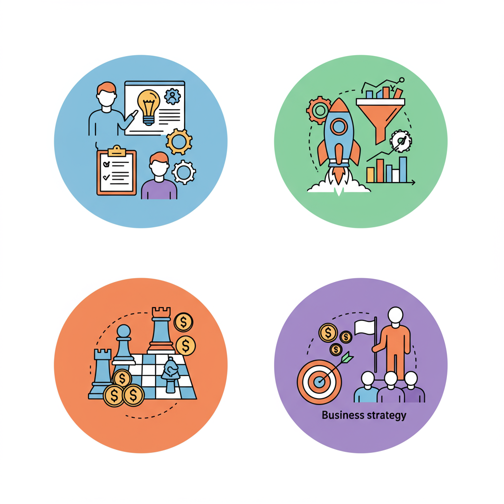

# AI Product Playbook

> AI 产品全链路修炼手册：从工程师到合伙人的成长路径

## 这是什么

后端工程师出身，在 AI 初创团队（元境）中发现：仅靠技术远远不够。这个仓库是从**工程师 → 合伙人**的实战成长记录，所有内容围绕元境产品展开，不做纯理论。

## 全景图：一张图看懂整个成长路径

  

  

> **交互式路线图**：打开 [`assets/roadmap.html`](./assets/roadmap.html) 可查看完整的交互式路线图（含可展开的 Checklist 和推荐书目）。

| 阶段 | 思维跃迁 | 核心问题 | 对应目录 | 时间 |
|:---:|---------|---------|---------|:---:|
| **Stage 1** | 工程师思维 → 产品思维 | 该不该做？做对产品 | `01-产品思维/` `02-AI产品专项/` | 1~3 月 |
| **Stage 2** | 产品思维 → 增长思维 | 数据涨了吗？跑通增长 | `03-增长与运营/` `04-数据驱动/` | 2~4 月 |
| **Stage 3** | 增长思维 → 商业思维 | 能不能赚钱？商业闭环 | `05-商业与战略/` | 4~6 月 |
| **Stage 4** | 商业思维 → 合伙人思维 | 公司往哪走？带队决策 | `06-团队与领导力/` `08-认知升级/` | 持续 |
| **贯穿全程** | — | 拆案例 + 随用随取 | `07-案例研究/` `09-工具箱/` | — |

> **工程师的天然优势**：逻辑严密（能发现需求漏洞）、边界思考（想到 PM 忽略的异常）、成本意识（评估技术成本提供替代方案）、数据能力（直接写 SQL 不依赖数据团队）。这些优势不要丢掉，要叠加。

## 最近更新

| 日期 | 内容 | 位置 |
|------|------|------|
| 2026-03-30 | SEO 与 GEO 优化策略 | `03-增长与运营/内容运营/` |
| 2026-03-30 | 初创公司财务管理框架 | `05-商业与战略/财务管理/` |
| 2026-03-30 | 初创公司法务合规要点 | `05-商业与战略/法务合规/` |
| 2026-03-30 | 客户关系管理 CRM | `05-商业与战略/客户关系管理/` |

---

## Stage 1：看懂用户，做对产品（1~3 个月）

> 核心转变：从"怎么实现"到"该不该做"

### 涉及目录

| 目录 | 你会学到 |
|------|---------|
| [01-产品思维/](./01-产品思维/) | 用户访谈 → 需求分析 → PRD → 竞品拆解，建立"需求三问"：给谁用？解决什么问题？怎么衡量？ |
| [02-AI产品专项/](./02-AI产品专项/) | 5 大 AI 产品设计模式（对话式/生成式/辅助式/Agent式/搜索增强式）、幻觉处理、Prompt 产品化 |

### 交付物 Checklist

- [ ] 完成 3 次用户访谈，输出用户画像文档
- [ ] 独立写出一份 PRD（从模仿 09-工具箱/模板 开始）
- [ ] 拆解 5 个 AI 产品的设计决策，输出到 07-案例研究/
- [ ] 总结 AI 产品的 5 大设计模式及其适用场景
- [ ] 梳理 AI 产品 UX 挑战清单（幻觉、等待、信任、上手引导）

### 推荐阅读

| 书名 | 一句话收获 |
|------|-----------|
| 《启示录》(Inspired) | 产品经理的核心职责与方法 |
| 《俞军产品方法论》 | 用户价值 = 新体验 - 旧体验 - 替换成本 |
| 《洞察力》(Lean Customer Development) | 轻量级用户研究方法 |

---

## Stage 2：驱动增长，跑通数据（2~4 个月）

> 核心转变：从"做了功能"到"看到数据涨了"

### 涉及目录

| 目录 | 你会学到 |
|------|---------|
| [03-增长与运营/](./03-增长与运营/) | AARRR 漏斗、北极星指标、内容/社区/渠道获客、SEO/GEO、PLG 实践 |
| [04-数据驱动/](./04-数据驱动/) | 指标体系设计、A/B 测试、漏斗分析、埋点方案、SQL 分析（工程师优势技能） |

### 交付物 Checklist

- [ ] 设计产品的北极星指标和完整 AARRR 漏斗
- [ ] 跑通一个获客渠道并量化效果（内容/社区/合作任选一）
- [ ] 设计埋点方案，搭建数据看板（PostHog/Mixpanel/Metabase）
- [ ] 完成首次 A/B 测试闭环：假设 → 方案 → 执行 → 结论
- [ ] 建立 AI 产品评估指标体系（质量、体验、商业三个维度）

### 推荐阅读

| 书名 | 一句话收获 |
|------|-----------|
| 《增长黑客》(Hacking Growth) | 数据驱动的增长方法论 |
| 《精益创业》(The Lean Startup) | MVP、Build-Measure-Learn 循环 |

### AI 产品增长的特殊性

- **体验即增长** —— Aha Moment 通常来自第一次使用
- **内容是武器** —— AI 生成的内容本身可以成为传播素材
- **API 是渠道** —— 开发者生态可以带来长尾增长

---

## Stage 3：商业判断，赚到钱（4~6 个月）

> 核心转变：从"做一个好产品"到"做一个好生意"

### 涉及目录

| 目录 | 你会学到 |
|------|---------|
| [05-商业与战略/](./05-商业与战略/) | SaaS/API/免费增值模式、AI 定价（Token 成本与用量）、TAM→SAM→SOM、融资 BP、财务管理、法务合规、CRM |

### 交付物 Checklist

- [ ] 梳理产品商业模式，算清单位经济模型（LTV、CAC、毛利率）
- [ ] 制定并验证定价策略（免费版 vs 付费版功能划分）
- [ ] 完成竞争格局分析，明确差异化定位
- [ ] 输出一份完整商业计划书
- [ ] 建立财务看板（现金跑道、项目利润率、回款周期）
- [ ] 梳理合同模板库（开发合同、NDA、合伙人协议）
- [ ] 搭建客户管理流程（商机漏斗 → 交付 → 维护）
- [ ] 完成商标注册和软件著作权申请

### 推荐阅读

| 书名 | 一句话收获 |
|------|-----------|
| 《从0到1》(Zero to One) | 创业与商业本质的思考 |
| 《好战略，坏战略》 | 战略不是目标，是解决关键挑战的路径 |

### 合伙人视角的商业原则

- **现金流 > 利润 > 收入** —— 初创公司死于现金流断裂
- **聚焦 > 全面** —— 找到一个切入点打穿，而不是铺开做
- **壁垒思维** —— 持续思考"别人抄我们怎么办"

---

## Stage 4：带队决策，持续修炼

> 核心转变：从个人贡献者（IC）到为整条业务线负责

### 涉及目录

| 目录 | 你会学到 |
|------|---------|
| [06-团队与领导力/](./06-团队与领导力/) | 团队搭建、跨部门协作（产研协同是工程师出身的独特优势）、OKR、合伙人权责 |
| [08-认知升级/](./08-认知升级/) | 第一性原理、系统思维、逆向思维、概率思维、结构化表达、行业认知 |

### 交付物 Checklist

- [ ] 建立跨部门协作机制（产研周会、需求评审流程）
- [ ] 制定团队 OKR 和产品路线图
- [ ] 培养至少 1 个能独当一面的下属
- [ ] 形成自己的决策框架（信息不完整时如何判断）
- [ ] 完成 1 次元境产品阶段性复盘，输出到 07-案例研究/元境案例/

### 推荐阅读

| 书名 | 一句话收获 |
|------|-----------|
| 《高产出管理》(High Output Management) | 管理者的杠杆率 |
| 《穷查理宝典》 | 多元思维模型 |
| 《思考，快与慢》 | 决策心理学 |
| 《原则》 | 把决策系统化 |

### 从工程师到合伙人的关键转变

| 维度 | 工程师 | 合伙人 |
|------|--------|--------|
| 关注点 | 代码质量、系统性能 | 公司发展、团队成长 |
| 成就感 | 解决技术难题 | 团队和产品的成功 |
| 时间分配 | 80% 写代码 | 30% 技术 + 30% 管理 + 40% 战略 |
| 决策方式 | 数据和逻辑 | 数据 + 直觉 + 判断力 |
| 责任范围 | 自己的模块 | 整条业务线甚至整个公司 |

---

## 贯穿全程

### [07-案例研究/](./07-案例研究/) — 每个阶段都要拆案例

每个案例回答 6 个问题：产品定位 → 核心体验（Aha Moment）→ 增长策略 → 商业模式 → 技术壁垒 → 对元境的启发

**待拆解清单**：ChatGPT / Cursor / Midjourney / Perplexity / Notion AI / Jasper / Runway / Character.ai / ChatGPT Wrapper 困境

### [09-工具箱/](./09-工具箱/) — 随用随取

模板（PRD、竞品分析、BP）和工具推荐（Figma、PostHog、Linear 等），详见目录内 README。

### 持续关注的信息源

| 资源 | 类型 | 价值 |
|------|------|------|
| Lenny's Newsletter | Newsletter | 硅谷顶级产品经理社区 |
| a16z AI Playbook | 指南 | AI 产品的设计与落地 |
| AIGC Weekly | 周刊 | AI 产品与技术动态 |
| ProductHunt | 平台 | 每日新产品发现与趋势 |

---

## 核心原则

1. **实战优先** —— 所有内容必须结合元境实际产品，不做纯理论
2. **工程师优势** —— 利用技术背景（懂成本、懂可行性、懂数据），而不是抛弃它
3. **回头成本思维** —— 做错了改的成本越高，越值得深度学习
4. **输出倒逼输入** —— 每学一个主题，必须输出一篇实战总结

## 文档规范

- 文件命名：`YYYY-MM-DD-描述性名称.md`
- 每篇文档必须包含：**背景** → **实践过程** → **效果/数据** → **经验总结**
- 标签分类：`#产品` `#增长` `#运营` `#商业` `#领导力` `#AI` `#案例`

## License

MIT
